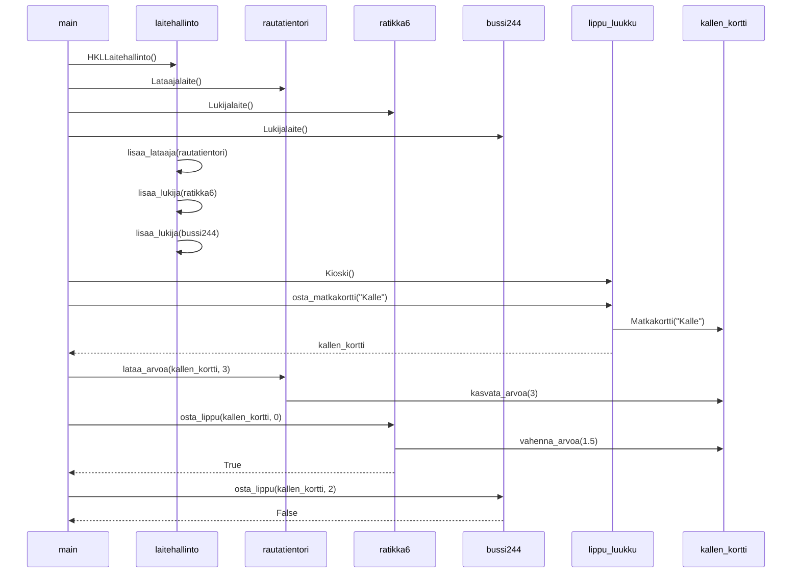

```mermaid
sequenceDiagram

main ->> laitehallinto: HKLLaitehallinto()
main ->> rautatientori: Lataajalaite()
main ->> ratikka6: Lukijalaite()
main ->> bussi244: Lukijalaite()

laitehallinto ->> laitehallinto: lisaa_lataaja(rautatientori)
laitehallinto ->> laitehallinto: lisaa_lukija(ratikka6)
laitehallinto ->> laitehallinto: lisaa_lukija(bussi244)

main ->> lippu_luukku: Kioski()
main ->> lippu_luukku: osta_matkakortti("Kalle")
lippu_luukku ->> kallen_kortti: Matkakortti("Kalle")
lippu_luukku -->> main: kallen_kortti

main ->> rautatientori: lataa_arvoa(kallen_kortti, 3)
rautatientori ->> kallen_kortti: kasvata_arvoa(3)
main ->> ratikka6: osta_lippu(kallen_kortti, 0)
ratikka6 ->> kallen_kortti: vahenna_arvoa(1.5)
ratikka6 -->> main: True
main ->> bussi244: osta_lippu(kallen_kortti, 2)
bussi244 -->> main: False
```
