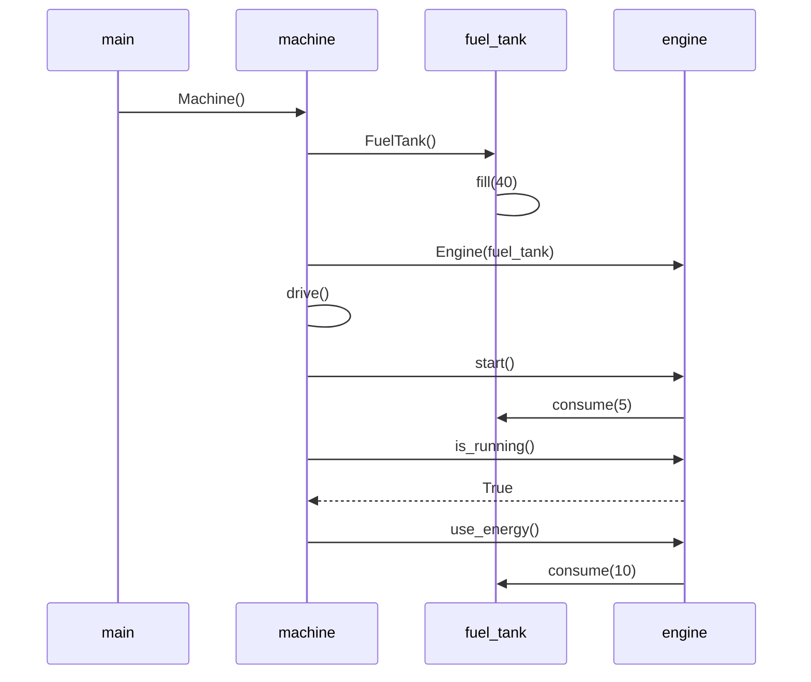

```mermaid
sequenceDiagram
main ->> machine: Machine()
machine ->> fuel_tank: FuelTank()
fuel_tank -> fuel_tank: fill(40)
machine ->> engine: Engine(fuel_tank)

machine -> machine: drive()
machine ->> engine: start()
engine ->> fuel_tank: consume(5)
machine ->> engine: is_running()
engine -->> machine: True
machine ->> engine: use_energy()
engine ->> fuel_tank: consume(10)

```
