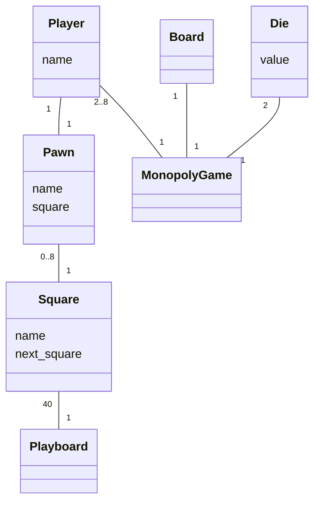

```mermaid
classDiagram
    class Die{
        value
    }
    class Player{
        name
    }
    class Playboard{
    }
    class Pawn{
        name
        square
    }
    class Square{
        name
        next_square
    }
    class MonopolyGame{
    }
    Die "2" -- "1" MonopolyGame
    Board "1" --  "1" MonopolyGame
    Player "2..8" -- "1" MonopolyGame
    Player "1" -- "1" Pawn
    Pawn "0..8" -- "1" Square
    Square "40" -- "1" Playboard
```