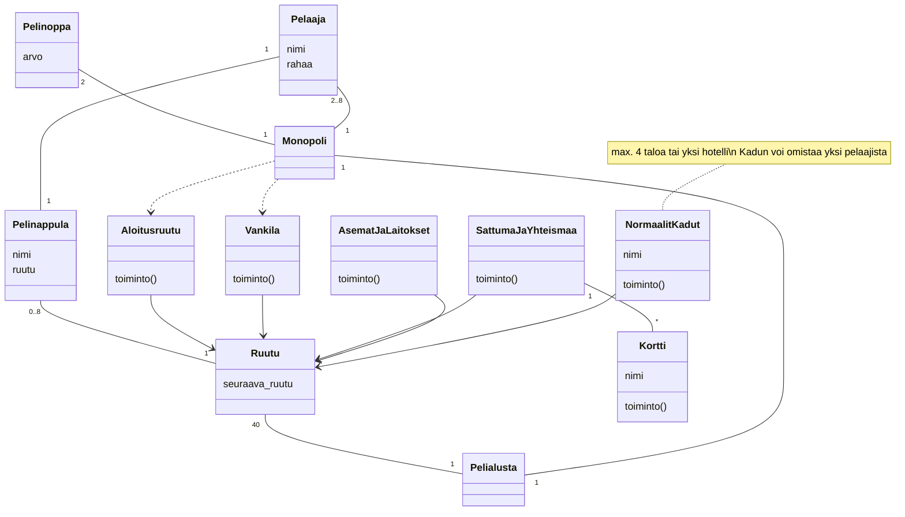

```mermaid
classDiagram
    class Pelinoppa{
        arvo
    }
    class Pelaaja{
        nimi
        rahaa
    }
    class Pelialusta{
    }
    class Pelinappula{
        nimi
        ruutu
    }
    class Ruutu{
        seuraava_ruutu
    }
    class Monopoli{
    }
    class Aloitusruutu{
        toiminto()
    }
    class Vankila{
        toiminto()
    }
    class SattumaJaYhteismaa{
        toiminto()
    }
    class AsematJaLaitokset{
        toiminto()
    }
    class NormaalitKadut{
        nimi
        toiminto()
    }
    class Kortti{
        nimi
        toiminto()
    }
    
    Pelinoppa "2" -- "1" Monopoli
    Pelialusta "1" --  "1" Monopoli
    Pelaaja "2..8" -- "1" Monopoli
    Pelaaja "1" -- "1" Pelinappula
    Pelinappula "0..8" -- "1" Ruutu
    Ruutu "40" -- "1" Pelialusta
    
    Aloitusruutu -->  Ruutu
    Vankila --> Ruutu
    SattumaJaYhteismaa --> Ruutu
    AsematJaLaitokset --> Ruutu
    NormaalitKadut --> Ruutu
    
    Monopoli ..> Vankila
    Monopoli ..> Aloitusruutu
    
    SattumaJaYhteismaa "1" -- "*" Kortti
    
    note for NormaalitKadut "max. 4 taloa tai yksi hotelli\n Kadun voi omistaa yksi pelaajista"
    
```
