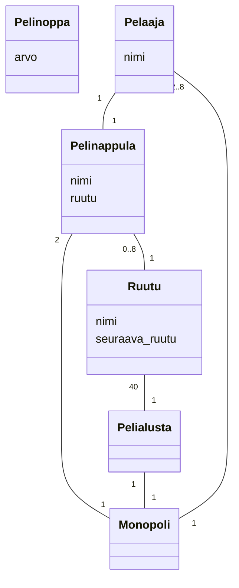

```mermaid
classDiagram
    class Pelinoppa{
        arvo
    }
    class Pelaaja{
        nimi
    }
    class Pelialusta{
    }
    class Pelinappula{
        nimi
        ruutu
    }
    class Ruutu{
        nimi
        seuraava_ruutu
    }
    class Monopoli{
    }
    Pelinappula "2" -- "1" Monopoli
    Pelialusta "1" --  "1" Monopoli
    Pelaaja "2..8" -- "1" Monopoli
    Pelaaja "1" -- "1" Pelinappula
    Pelinappula "0..8" -- "1" Ruutu
    Ruutu "40" -- "1" Pelialusta

```
    Aloitusruutu -->  Ruutu
    Vankila --> Ruutu
    Sattuma ja yhteismaa -> Ruutu
    Asemat ja laitokset --> Ruutu
    Normaalit kadut --> Ruutu
