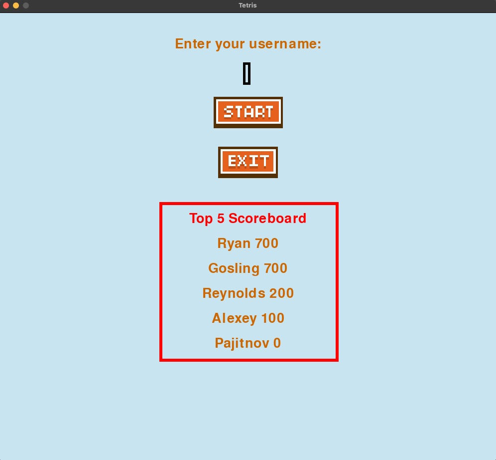
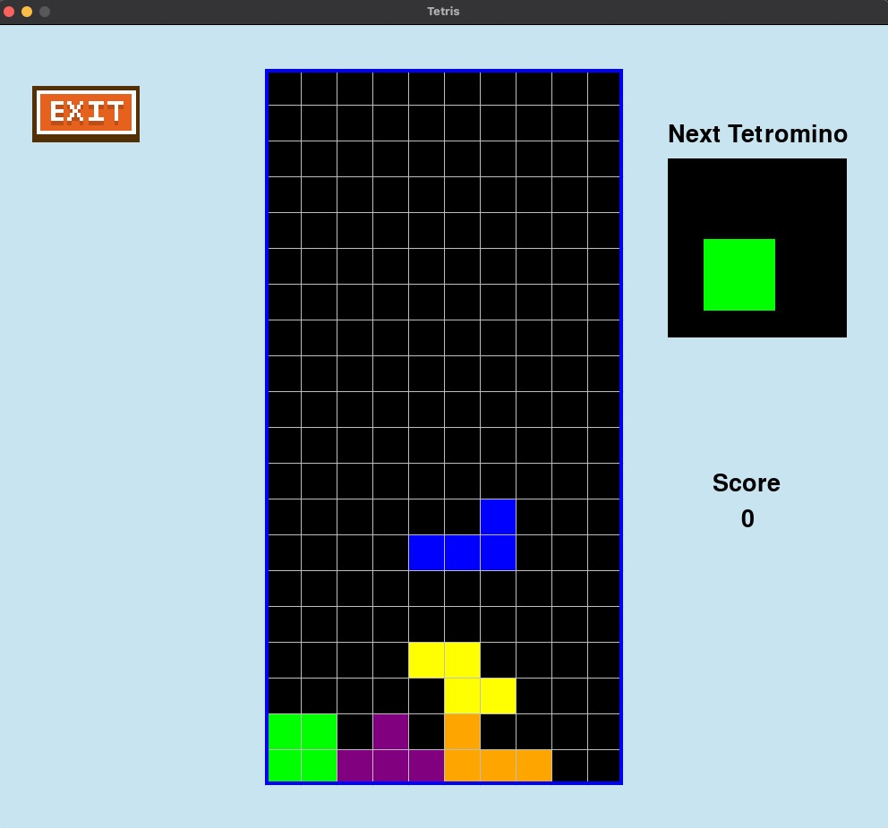
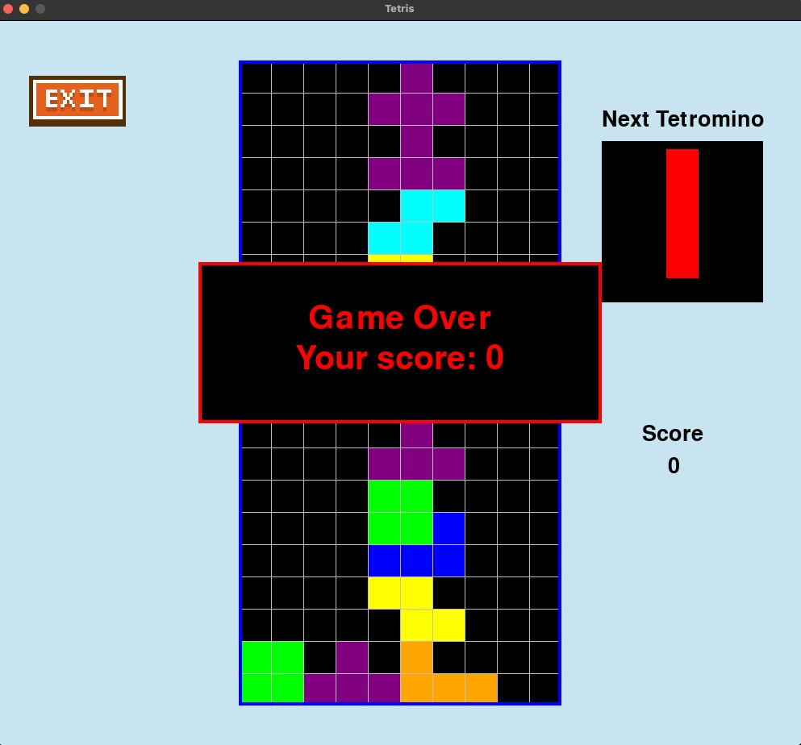

# Käyttöohje
Projekti on ladattavissa viimeisimmästä releasista

## Ohjelman käynnistäminen
Kun olet ladannut projektin, siirry sovelluksen juurihakemistoon komennolla

```bash
cd tetris-game
```

Jonka jälkeen lataa riippuvuudet komennolla

```bash
poetry install
```

Ja käynnistä peli komennolla

```bash
poetry run invoke start
```

## Käyttäjätunnuksen syötto
Peli voidaan käynnistää kun ollaan syötetty vähintään 3-merkin pituinen käyttäjätunnus.


Riittää, että aloittaa kirjoittaa ilman että painaa syöteikkunaan. Pelin voi aloittaa painamalla "Start"-painiketta.

## Pelin suorittaminen
Peliä pelataan käyttämällä nuolinäppäimiä niinkuin tavallista tetristäkin.


## Pelin lopetus
Peli loppuu, kun tetrominoja kasaantuu ruudukon yläreunan yli, jonka jälkeen peli ilmoittaa vielä saaduista pisteistä ja palaa päävalikkoon sekuntien päästä.


Vaihtoehtoisesti pelistä pääsee päävalikkoon "Exit"-painikkeen avulla.
