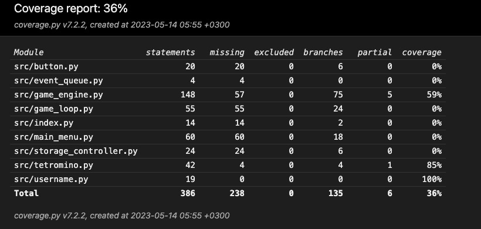

# Testausdokumentti
Sovellusta on testattu yksikkötesteillä.

## Yksikkötestaus

### Pelilogiikka
Pelilogiikasta vastaavaa luokkaa `GameEngine` on testattu `TestGameEngine`-testausluokalla. Luokan testausta varten testausluokka alustetaan luomalla `GameEngine`-luokka ja luomalla sille uusi peliruudukko. `GameEngine`on projektin suurin ja toiminnan kannalta tärkein luokka, joka sisältää eniten toiminnallisuutta, ja siksi kyseisen luokan testaus on laajin.

### Peliobjektit
Peliobjekteista, eli tetrominoista vastaavaa luokkaa `Tetromino` on testattu `TestTetromino` testausluokalla. Luokan testausta varten testausluokka alustetaan luomalla `GameEngine`-luokka, joka on välttämätön pelisilmukan sisäisten luokkien toimintaan. Pelimoottorille luodaan peliruudukko ja testausluokalle uusi Tetromino-objekti.

### Käyttäjätunnus
Käyttäjätunnuksesta vastaavaa luokka `Username` on testattu `TestUsername`-testausluokalla.

## Testikattavuus
Sovelluksen testauksen haarautumakattavuus on 36%

## Laitetestaus
Sovellusta on testattu macOS- sekä Linux-käyttöjärjestelmällä.
